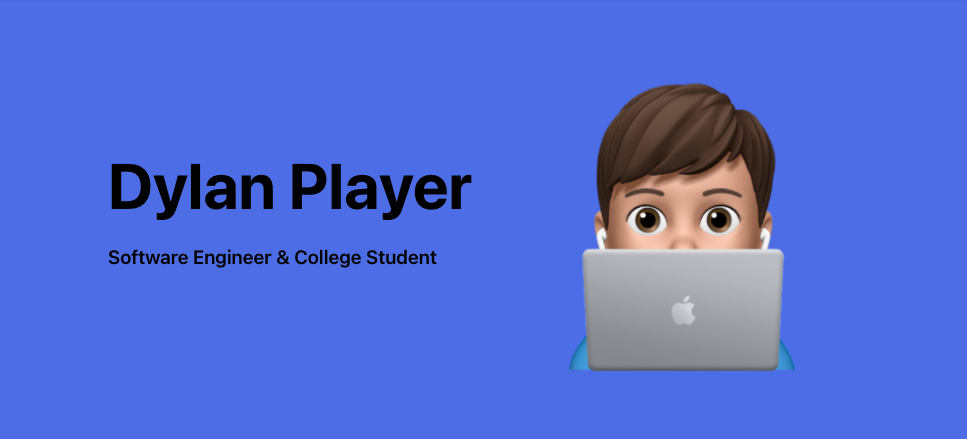

# Hi everyone 👋

I am currently a software engineering intern at [Shopify](https://shopify.com) and a computer science student at The Dominican University of California. I mainly code in Typescript and Ruby. I mainly work in React and Ruby on Rails. Currently I am not working on any open-source projects but I plan to in the future. Currently I am working on building out free tutorials on my [website](https://dylanplayer.com/tutorials) and [makeschool.fail](https://makeschool.fail). Feel free to check out my portfolio [here](https://dylanplayer.com).

## Contact 📞
 

